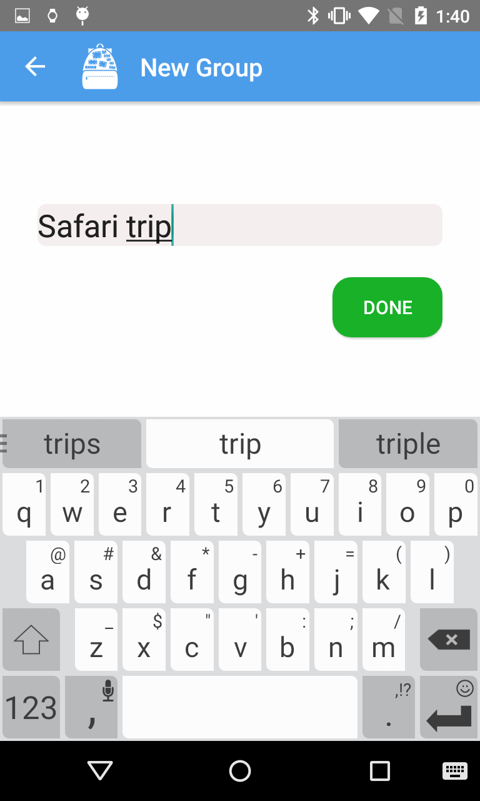

# Personal Inventory Assistant

Date updated: August 14, 2015

This is an inventory assistant that uses NFC technology to help users keep track of their physical belongings!
 
## Features
- Tag important and valuable items with cheap NFC tags: http://amzn.com/B00DRDZ07A
- Make groups of items for your trips and add the items into the app
- Scan items before moving locations to keep track of them
- View scan history and location
- Never lose anything again, anywhere!
## Details
- Developed with Android Studio targeting Android Lollipop mobile and smartwatch devices
- Hackster page: https://www.hackster.io/6860/team-ndroids

## Demo videos

## Screenshots

